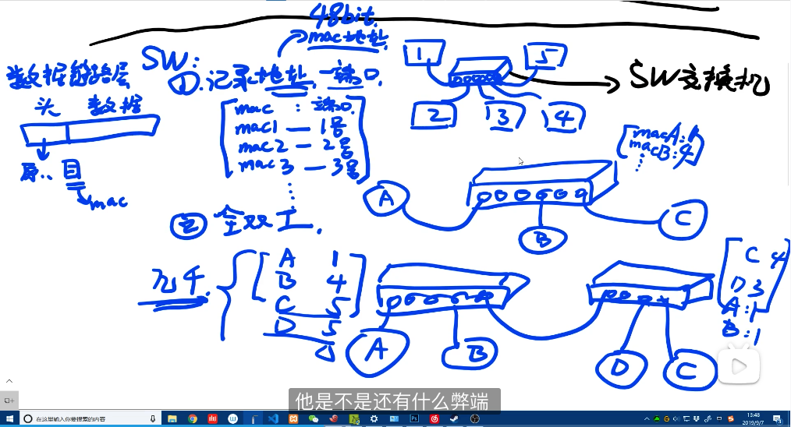

### 物理层网卡

每个网卡都有一个唯一的mac地址，全球的网卡制作商统一管理，由指定的一部分发放

mac地址主要分为两部分，分配的厂商编号+厂商自定义的编号

主要通过双绞线、网线、光缆、无线电波等发送0或1的电信号

## 一般请求图一

发给每个机器，存储每一台机器的标识

## 集线器转发图二

广播式数据发送发给其他的每一台机器，收到数据后判断；

集线器并行处理消息时，消息混乱，CAMA/CD：载波侦听，转发数据时检测是否有其他消息。

使用双绞线，一台数据发送或接收

缺点：链路利用率低，并发低，无法承载大量的服务器

## 交换机图三

数据链路层，数据投中记录源地址、目标地址（几千个）

mac地址表，刚开始是空的，当A从1号口发送一条给B的消息时，交换机知道A在1号口，会把这条信息记录在mac地址表中，然后从mac地址找B的mac地址，没有找到，通过广播协议 给其他机器发送消息，询问谁是B，此时2好口返回回应，那就知道了B在2号口，记录到mac地址表中，然后消息也会发到2号口

数据链路层：数据中包含数据头和数据，数据头中包含源mac地址和目标mac地址

特点：可以桥接，

记录服务器地址-端口（物理地址、mac地址）

pc1:mac1 - 1号口

pc2:mac2 - 2号口

pc3:mac3 - 3号口

接入设备后记录端口号；

网线，8根线，实现全双工，发送同时可以接收

局域网内很OK

## 路由器

属于网络层，与交换机有一部分功能相同，

- 路由器属于第三层、交换机属于第二层，第二层主要就是记录mac地址表，收到消息时发给指定人，而不会像集线器一样发给每一个接口
- 路由器能在多条路径计算出最佳路径，发送数据时路由表一起发送
- 路由器能连接多个网路，二交换机只能连接两个
- 路由器具有IP分享器功能，多台设备可以使用同一个线路连接外路，比如不同的设备使用同一个IP地址同时上网，

