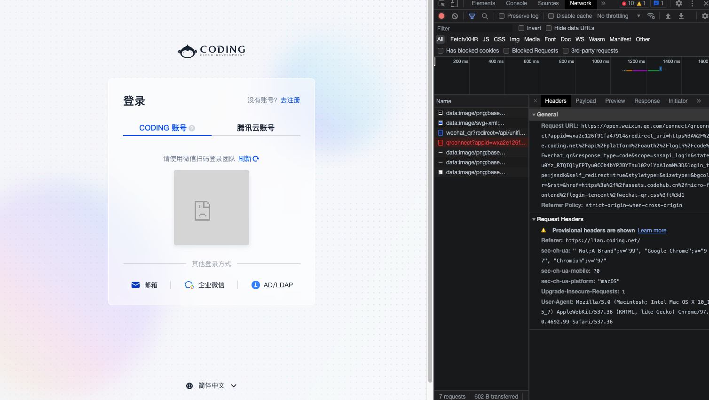

# TKE + Coding 快速发布应用至Kubernetes服务器中

> 快速发布应用至Kubernetes中，演示使用到的道具有：
>
> - TKE：腾讯云容器服务，全称为Tencent Kubernetes Engine
>
> - Coding：腾讯云提供的一站式开发协作工具，帮助应用快速落地与DevOps的实现

## 创建TKE服务器

### 服务器配置

### 安装kubesphere

## 配置Coding

## 其他问题

Coding网站微信二维码不现实😅

如下图所示，图片请求显示`Provisional headers ar shown`，解决方法可以右键异常的`qrconnect`请求，点击`Open in new tab`，然后扫描新的tab页中的微信二维码，即可登录。

