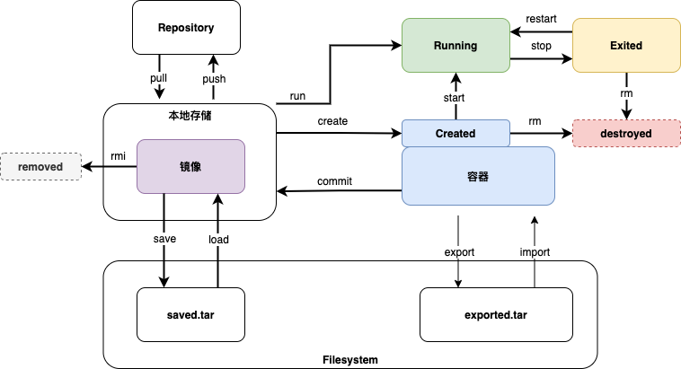

## 一、安装
### 1.1 在线安装
```bash
sudo yum -y install gcc
sudo yum -y install gcc-c++

yum remove docker \
           docker-client \
           docker-client-latest \
           docker-common \
           docker-latest \
           docker-latest-logrotate \
           docker-logrotate \
           docker-engine
           
sudo yum install -y yum-utils

# 阿里云
sudo yum-config-manager \
    --add-repo \
    http://mirrors.aliyun.com/docker-ce/linux/centos/docker-ce.repo
# 官方
sudo yum-config-manager \
    --add-repo \
    https://download.docker.com/linux/centos/docker-ce.repo
    
yum makecache fast

yum install -y docker-ce docker-ce-cli containerd.io

systemctl start docker


# 镜像加速
sudo mkdir -p /etc/docker
sudo tee /etc/docker/daemon.json <<-'EOF'
{
  "registry-mirrors": ["https://7alrgvv7.mirror.aliyuncs.com"]
}
EOF
sudo systemctl daemon-reload
sudo systemctl restart docker
```

### 1.2 离线安装
-   rpm 网站：<http://rpmfind.net/linux/RPM/index.html>
-   rpm 网站：<http://ftp.riken.jp/>
-   Centos 官方库：<http://mirror.centos.org/>

官方下载docker地址：<https://download.docker.com/linux/>

淘宝下载docker地址：<https://mirrors.aliyun.com/docker-ce>（无法访问）

要是yum安装特别慢，登陆官方下载docker的地址，下载docker的rpm，本地安装，依赖通过yum自动安装。

安装顺序为：

1.  containerd.io
2.  docker-ce-cli
3.  docker-ce-rootless-extras && docker-ce


## 二、docker-compose
### 2.1 结构
```yaml
verison: ''
service:
  serv1: mysql
  serv2: redis
  serv3: web
  
volumes:
networks:
configs:
```

### 2.2 官网样例
```yaml
version: '3.3'

services:
   db:
     image: mysql:5.7
     volumes:
       - db_data:/var/lib/mysql
     restart: always
     environment:
       MYSQL_ROOT_PASSWORD: somewordpress
       MYSQL_DATABASE: wordpress
       MYSQL_USER: wordpress
       MYSQL_PASSWORD: wordpress

   wordpress:
     depends_on:
       - db
     image: wordpress:latest
     ports:
       - "8000:80"
     restart: always
     environment:
       WORDPRESS_DB_HOST: db:3306
       WORDPRESS_DB_USER: wordpress
       WORDPRESS_DB_PASSWORD: wordpress
       WORDPRESS_DB_NAME: wordpress
volumes:
    db_data: {}
```

## 三、DockerFile

### 3.1 命令
|关键字|作用|
|----|----|
|FROM|指定基础镜像，一切从这个惊现刚开始构建|
|MAINTAINER | 作者（姓名<邮箱>）|
|RUN        | 构建时需要运行的命令|
|ADD        | 添加到镜像的文件（可以从网络）|
|WORKDIR    | 镜像工作目录，/bin/bash或bash等|
|VOLUME     | 容器内挂载目录 -v|
|EXPOST     | 暴露端口 -p|
|CMD        | 容器启动时执行的命令，只有最后一个生效，可被替代|
|ENTRYPOINT | 容器启动时执行的命令，可以追加|
|ONBUILD    | 这个时候就会运行ONBUILD|
|COPY       | 类似ADD，将本地文件拷贝到镜像中，两段form：--form=as1 /source /target|
|ENV        | 设置环境变量 ENV a=10 || a 10|
|ARG        | 构建过程的参数，可以--build-arg传参，其他命令引用|
|LABEL      | 镜像制作过程无意义，可以对镜像操作时用来过滤|
|USER       | 指定指令运行用户身份，默认root |

### 3.2 样例
#### 3.2.1 普通格式
```
FROM centos

MAINTAINER lianchuanguang<lianchuanguang@gmail.com>

ENV MYPATH /usr/local
WORKDIR $MYPATH

RUN yum -y install vim
RUN yum -y install net-tools

EXPOSE 80

CMD echo $MYPATH
CMD echo "-end-"
CMD /bin/bash
```
#### 3.2.2 两端格式
```
FROM alpine AS haha
......
.......
FROM ubuntu 
.....
COPY --from=haha /src /des
.....
```

## 四、操作图谱


## 五、发布到阿里云

```bash
 # 1.登陆 LChg19940824
 docker login --username=账号名 registry.cn-hangzhou.aliyuncs.com
 # 2.镜像tag（重命名）
 docker tag [ImageId] registry.cn-hangzhou.aliyuncs.com/lian_default_namespace/<镜像名字>:[镜像版本号]
 # 3.或者打包时直接打包成已经规范命名
 docker build -t registry.cn-hangzhou.aliyuncs.com/lian_default_namespace/<镜像名字>:[镜像版本号]
 # 3.push
 docker push registry.cn-hangzhou.aliyuncs.com/lian_default_namespace/<镜像名字>:[镜像版本号]
```

## 六、网络

### 6.1 普通连接

```bash
 # 连接网络
 # --link tomcat01 hosts中会增加tomcat1及他的网址
 docker run -d --link tomcat01 --name tomcat02 tomcat:1.0
```

### 6.2 自定义网络

```bash
 # 自定义网络
 # --driver bridge 桥接模式（默认）
 # --subnet 子网地址，创建容器指定自定义网络时，容器的ip地址就在这个子网地址范围内
 #          192.168.0.1/16 192.168.0.0/16 255*255个地址
 #          192.168.0.1/24 255个地址 
 # --gateway 192.168.3.1 网关（路由器地址）
 docker network create --driver bridge --subnet 192.168.0.1/16 --gateway 192.168.3.1 mynet
 
 # 使用自定义网络
 docker run -t -P --name tomcat01 --net mynet tomcat
 docker run -t -P --name tomcat02 --net mynet tomcat
 
 # 网络可以随意访问
 # tomcat01 访问 tomcat02
 docker exec -it tomcat01 ping tomcat02
 docker exec -it tomcat01 ping 192.168.0.2 # 192.168.0.2是tomcat02的IP地址
 # tomcat02 访问 tomcat01
 docker exec -it tomcat02 ping tomcat01
 docker exec -it tomcat02 ping 192.168.0.1 # 192.168.0.1是tomcat01的IP地址
```