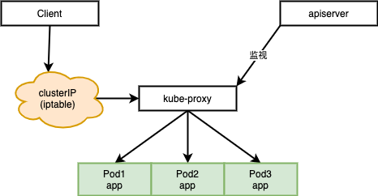
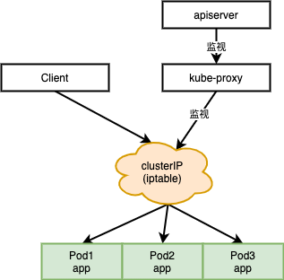

集群编排

## 一、组件

### Control plane
- kube-apiserver：Kubernetes 控制平面的前端，通过API来定义、部署、管理容器的生命周期
- kube-scheduler：Pod 调度器，权衡集群节点运行情况，将Pod放到合适的节点上，包括资源需求、硬件/软件/策略约束、亲和性和反亲和性等
- kube-controller-manager：运行控制器进程的控制平面组件
  - 节点控制器（Node Controller）：负责在节点出现故障时进行通知和响应
  - 任务控制器（Job controller）：监测代表一次性任务的 Job 对象，然后创建 Pods 来运行这些任务直至完成
  - 端点控制器（Endpoints Controller）：填充端点(Endpoints)对象(即加入 Service 与 Pod)
  - 服务帐户和令牌控制器（Service Account & Token Controllers）：为新的命名空间创建默认帐户和 API 访问令牌
- cloud-controller-manager：云服务商提供的特定控制器进程的控制平面组件
  - 节点控制器（Node Controller）：用于在节点终止响应后检查云提供商以确定节点是否已被删除
  - 路由控制器（Route Controller）：用于在底层云基础架构中设置路由
  - 服务控制器（Service Controller）：用于创建、更新和删除云提供商负载均衡器

### Node
- kubelet：工作节点代理，接收 Pod 声明维护 Pod 在期望状态下运行，发送工作节点运行情况
- kube-proxy：节点的网络代理，维护节点的网络规则，通过系统的过滤层或通过自身转发流量
- etcd：一致性、高可用性，保存 Kubernetes 所有后台数据
- container runtime：容器运行时，Docker、containerd、CRI-O等

## 二、负载资源

缩略图：


### 1 Deployment

用户声明Deployment来维护应用的运行状态，Deployment控制器将会创建和修改ReplicaSet以受控速率将应用变为期望状态

#### 1.1 基本操作

```shell
# deployment
kubectl create deployment hello-node --image=k8s.gcr.io/echoserver:1.4
kubectl edit deployment.v1.apps/nginx-deployment
kubectl set deployment.v1.apps/nginx-deployment nginx=nginx:1.14.2 --record=true
kubectl rollout history deployment.v1.apps/nginx-deployment
kubectl rollout undo deployment.v1.apps/nginx-deployment --to-revision=10
kubectl scanle deployment.v1.apps/nginx-deployment --replicas=10
kubectl autoscanle deployment.v1.apps/nginx-deployment --min=10 --max=15 --cpu-percent=80

# service
kukectl expose deployment hello-node --type=LoadBanlancer --port=8080
kubectl get services
kubectl delete service nginx-deployment

# 其他
kubectl get deployments --show-labels
kubectl get rs --show-labels # ReplicaSet
kubectl get pods --show-labels
kubectl get events
kubectl rollout status deployment/hello-node # 部署进度
kubectl delete deployment hello-node
kukectl describe deployment nginx-deployment
kubectl describe service nginx-deployment
kubectl logs -f  nginx-deployment-559d658b74-7kgpx
kubectl exec -it  nginx-deployment-559d658b74-7kgpx sh
```

#### 1.2 Yaml 结构

```yaml
apiVersion: apps/v1
kind: Deployment # 声明为Deployment
metadata: # Deployment元信息
  name: nginx-deployment # Deployment名称
  labels: # 匹配标签，重叠时无法工作
    app: nginx # 标签内容
spec:
  replicas: 3 # 副本数量，默认1
  strategy: 
    type: RollingUpdate # 替换版本时的策略：RollingUpdate滚动更新、Recreate重建（关闭全部）
    rollingUpdate: 
      # 这两个值至少保证有一个不为0，不然没法更新
      maxUnavailable: 10% # 数量或百分比，滚动更新时，旧rs缩容最多关闭10%的服务器，然后就扩容新rs，默认值25%
      maxSurge: 20% # 数值或半分比，滚动更新时，先扩容新rs，最多到达120%，然后缩容旧rs
  progressDeadlineSeconds: 60 # 秒数，意义？？
  minReadySeconds: 10 # pod没有崩溃情况下持续10秒后，才会被置为可用状态
  revisionHistoryLimit: 10 # rs历史修订版本保留数量，默认10个
  paused: true # true时，不会触发deployment的上线，默认false
  selector: # pod标签选择算符，明确设置，不可变，需匹配.spec.template.metadata.labels
    matchLabels:
      app: nginx
  template: 
    metadata:
      labels:
        app: nginx
    spec:
      containers: # 容器信息
      - name: nginx # 容器名
        image: nginx:1.14.2 # 镜像版本
        ports: # 端口信息
        - containerPort: 80
```

#### 1.3 检查启动情况

```shell
# 创建一个服务
kukectl expose deployment hello-node --type=LoadBanlancer --port=8080
# 获取所有服务
kubectl get services
# 删除服务
kubectl delete service nginx-deployment
kubectl describe service nginx-deployment
kubectl logs -f  nginx-deployment-559d658b74-7kgpx
kubectl exec -it  nginx-deployment-559d658b74-7kgpx sh
```

### 2 ReplicaSet

维护一组任何时候都处于运行状态的Pod副本的集合，用于维护给定数量、完全相同的Pod的可用性；

官方不推荐直接使用ReplicaSet，一般通过Deployment来维护

### 3 StatefulSet

维护一组稳定的、有序的、持久的Pod，包括存储、网络标识？、扩缩容、停止等

```yaml
apiVersion: v1
kind: Service
metadata:
  name: nginx
  labels:
    app: nginx
spec:
  ports:
  - port: 80
    name: web
  clusterIP: None # headless service
  selector:
    app: nginx
---
apiVersion: apps/v1
kind: StatefulSet
metadata:
  name: web
spec:
  selector:
    matchLabels:
      app: nginx # has to match .spec.template.metadata.labels
  serviceName: "nginx"
  replicas: 3 # by default is 1
  updateStrategy: # 更新策略
    type: RollingUpdate # RollingUpdate：自动滚动更新（从大到小）；OnDelete：需要用户手动删除Pod，控制器自动创建新的Pod
    rollingUpdate:
      partition: 2 # 大于这个分区号的Pod才会被更新，在分阶段上线、执行金丝雀时可能使用
  minReadySeconds: 10 # 最小就绪时间，特性门控启动时才会生效
  template:
    metadata:
      labels:
        app: nginx # has to match .spec.selector.matchLabels
    spec:
      terminationGracePeriodSeconds: 10
      containers:
      - name: nginx
        image: k8s.gcr.io/nginx-slim:0.8
        ports:
        - containerPort: 80
          name: web
        volumeMounts:
        - name: www
          mountPath: /usr/share/nginx/html
  volumeClaimTemplates:
  - metadata:
      name: www
    spec:
      accessModes: [ "ReadWriteOnce" ]
      storageClassName: "my-storage-class" # 指定的持久存储服务
      resources:
        requests:
          storage: 1Gi
```

滚动更新异常时需要人工干预：修复问题后手动删除有问题的Pod

### 4 DaemonSet

创建守护线程Pod，一般用于监控和日志收集


设置Node的污点，符合污点条件的Pod才能匹配到此Node。

```shell
kubectl taint nodes node1 key1=value1:NoSchedule
```


```yaml
apiVersion: apps/v1
kind: DaemonSet
metadata:
  name: fluentd-elasticsearch
  namespace: kube-system
  labels:
    k8s-app: fluentd-logging
spec:
  selector: # 不能修改
    matchLabels:
      name: fluentd-elasticsearch
  template:
    metadata:
      labels: # 与 .spec.selector 匹配
        name: fluentd-elasticsearch
    spec:
      tolerations: # Pod的容忍度
      # this toleration is to have the daemonset runnable on master nodes
      # remove it if your masters can't run pods
      - key: node-role.kubernetes.io/master
        operator: Equal # 或Exists
        effect: NoSchedule
      nodeSelector: # node选择算符
        key: value
      containers:
      - name: fluentd-elasticsearch
        image: quay.io/fluentd_elasticsearch/fluentd:v2.5.2
        resources:
          limits:
            memory: 200Mi
          requests:
            cpu: 100m
            memory: 200Mi
        volumeMounts:
        - name: varlog
          mountPath: /var/log
        - name: varlibdockercontainers
          mountPath: /var/lib/docker/containers
          readOnly: true
      terminationGracePeriodSeconds: 30
      volumes:
      - name: varlog
        hostPath:
          path: /var/log
      - name: varlibdockercontainers
        hostPath:
          path: /var/lib/docker/containers
```

## 三、网络

```yaml
apiVersion: v1
kind: Service
metadata:
  name: my-service # 匹配Pod
spec:
  externalTrafficPolicy: Cluster # 外部流量策略，Cluster/Local，会路由到集群中的其他节点或只路由到当前节点
  internalTrafficPolicy: Cluster # 内部流量策略，同上
  ports:
    - protocol: TCP
      port: 80
      targetPort: 9376
```

### 1 代理

##### 1.1 userspace 代理模式



##### 1.2 iptables 代理模式



##### 1.3 IPVS 代理模式

需在kube-proxy启动前使IPVS已经处于可用状态，未检测到IPVS模块时，自动切换至iptables代理模式


### 2 服务类型

##### 2.1 ClusterIP

默认值，内部IP暴露的服务，只能通过内部访问

##### 2.2 NodePort

通过静态端口暴露服务，可以通过ip:port的方式从外部访问，端口多时容易冲突

##### 2.3 LoadBalancer

一个真实的负载均衡器，用户通过负载均衡来请求service，因为两层转发所以存在性能问题

##### 2.4 ExternalName

服务会映射到DNS中，用户请求后会通过DNS解析获取具体的service访问方式